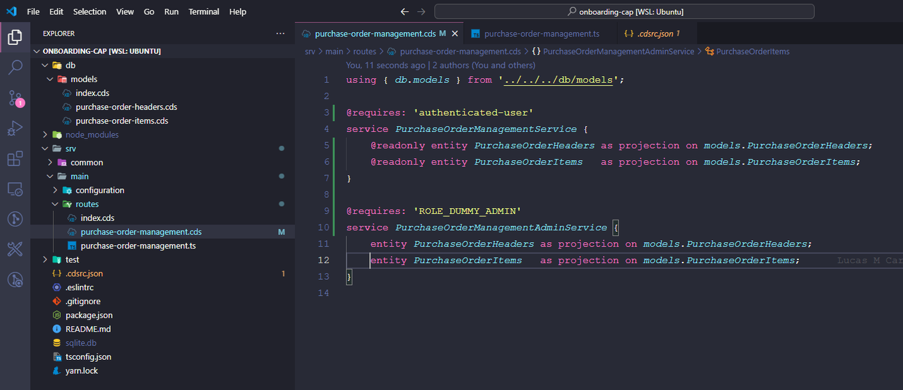

# Modelos

Modelos são representações abstratas de dados (Data Models) necessários para o funcionamento do aplicativo. Por exemplo, um Data Model pode definir a estrutura de uma entidade Usuário.


*Entidade Users*

# Serviços

Serviços são representações abstratas (Service Models) necessários para o funcionamento do aplicativo. Por exemplo, um Service Model pode oferecer operações relacionadas à gestão da entidade usuário criada anteriormente. Por padrão, os serviços expõem todas as operações de CRUD para cada entidade exposta, podendo ou não serem sobrescritas pelos desenvolvedores para alterar o comportamento padrão.


*Serviço UserManagemnet*

No exemplo acima, o serviço UserManagement irá expor a entidade Users com todos os verbos HTTP (GET, PUT, POST, DELETE e PATCH) disponíveis para uso. Para acessar este serviço, no ambiente local, o usuário deve enviar uma request com alguns dos métodos HTTP mencionados acima para <http://localhost:4004/user-management/Users>

# CDS Query Language (CQL)

O CQL é empregado para realizar operações de consulta nos dados modelados usando o CDS. Isso inclui filtragem, ordenação, projeção e outras operações típicas em operações de leitura de dados. A linguagem utiliza uma sintaxe de fácil aprendizagem, facilitando a criação de consultas complexas sem a necessidade de escrever extensas instruções SQL. É possível utilizar o CQL tanto nos arquivos CDS quanto em arquivos Typescript/Javascript. Abaixo mostraremos alguns exemplos de utilização para ambos os casos.

## Filtragem

Ele permite a aplicação de filtros para recuperar apenas os dados desejados.


*Exemplo de filtragem utilizando CDS*

No exemplo acima, podemos ver estamos criando uma view chamada TestUser que buscará os dados de usuário onde o e-mail for igual a <teste@b2rise.com>. Quando acessamos o ambiente local, podemos ver que agora foi criada essa nova visão TestUser:


*Página inicial da API*

Quando acessamos a TestUser, podemos ver que o filtro está sendo aplicado e trazendo somente o usuário correspondente:


*View TestUser*

O mesmo exemplo aplicado em Typescript ficaria deste jeito:


*Exemplo de filtragem utilizando Typescript*

No exemplo acima, podemos ver que antes de ler a entidade Users estamos executando o método beforeReadUsers para exibir no console os dados do usuário com o e-mail <teste@b2rise.com>. O método where é responsável por criar essa filtragem e retornar somente o que queremos. Por baixo, o CQL gerará uma consulta SQL parecida com esta:

```SQL
SELECT * FROM Users WHERE email = 'teste@b2rise.com';
```

## Ordenação

É possível ordenar os resultados com base em um ou mais campos.


*Ordenação utilizando CDS*


Como podemos ver no exemplo acima, quando colocamos os comandos de ordenação, os dados da consulta são retornados de acordo com o que solicitamos.

O mesmo exemplo aplicado em Typescript ficaria deste jeito:


*Exemplo de ordenação com Typescript*

No exemplo acima, podemos ver que antes de ler a entidade Users estamos executando o método beforeReadUsers para exibir no console os dados do usuário com o e-mail <teste@b2rise.com>. O método orderBy é responsável por retornar os dados ordenados. Por baixo, o CQL gerará uma consulta SQL parecida com esta:

```SQL
SELECT *
FROM Users
WHERE email = 'teste@b2rise.com'
ORDER BY firstName, email;
```

Projeção de dados
Também conseguimos selecionar quais dados queremos projetar na nossa consulta, isto é, quais colunas desejamos selecionar.

Na consulta, basta passarmos quais campos queremos selecionar e o CAP se encarrega de retornar somente estes campos:


*Consulta utilizando CDS*


O mesmo exemplo aplicado em Typescript ficaria deste jeito:


*Projeção de dados com Typescript*

No exemplo acima, podemos ver que antes de ler a entidade Users estamos executando o método beforeReadUsers para exibir no console os dados do usuário com o e-mail <teste@b2rise.com>. O método columns é responsável por retornar os dados ordenados. Por baixo, o CQL gerará uma consulta SQL parecida com esta:

```SQL
SELECT email, userName, firstName, lastName
FROM Users
WHERE email = 'teste@b2rise.com'
ORDER BY firstName, email;
```

# Exercícios

## Exercícios Teóricos

- Explique o conceito de Modelos no desenvolvimento de aplicativos. Por que são importantes?

Utilize o exemplo da entidade Users para ilustrar sua resposta.

Os *modelos* são essenciais para definir como os dados são organizados em um aplicativo. Eles garantem que as informações estejam organizadas e consistentes.

O modelo de usuários é uma representação dos dados necessários para armazenar informações sobre os usuários em um sistema. Ele inclui os seguintes campos:

- **id:** Identificador único do usuário (UUID).
- **email:** Endereço de e-mail do usuário (String de até 100 caracteres).
- **userName:** Nome de usuário do usuário (String de até 100 caracteres).
- **password:** Senha do usuário (String de até 100 caracteres).
- **firstName:** Primeiro nome do usuário (String de até 50 caracteres).
- **lastName:** Sobrenome do usuário (String de até 50 caracteres).

Este modelo é utilizado para garantir a consistência e a estrutura dos dados relacionados aos usuários dentro do sistema.

- Descreva o papel dos Serviços em um aplicativo e como eles interagem com os Modelos.

Referencie o serviço UserManagement para explicar como os serviços expõem operações CRUD.

Os serviços desempenham um papel fundamental na implementação de funcionalidades específicas e na comunicação entre diferentes partes do sistema.

```
service UserManagement {
     entity User as projection on db.Users
}
```

No contexto do exemplo do serviço UserManagement, ele age como uma interface para manipular os dados relacionados aos usuários do sistema.

- O que é a CDS Query Language (CQL) e como ela se diferencia do SQL tradicional?

Apresente vantagens do uso do CQL em projetos que utilizam CAP.

É uma linguagem de consulta de dados introduzida pela SAP no contexto de seu CDS (Core Data Services).

Utilizar CQL em projetos oferece uma série de vantagens notáveis. Sua compatibilidade com diversos bancos de dados suportados pelo CAP simplifica a gestão dos sistemas. Além disso, o CQL promove a manutenção de um código mais limpo e compreensível, tornando o processo de desenvolvimento mais facil. Com uma sintaxe simplificada, ele aumenta a produtividade.

## Exercícios Práticos

- Criando uma Entidade Books

Baseado no exemplo da entidade Users, crie uma entidade Books com os campos id, title, author, e publishedYear.

- Definindo um Serviço BookManagement

Com base no serviço UserManagement, defina um serviço BookManagement que expõe a entidade Books com operações de CRUD.

- Filtragem com CQL

Escreva uma consulta CQL para filtrar livros publicados após o ano de 2000. Implemente esta filtragem tanto em um arquivo CDS quanto em um arquivo Typescript.

- Ordenação de Dados

Utilizando a entidade Books, crie uma consulta CQL que ordene os livros por publishedYear em ordem decrescente e, em seguida, por title em ordem ascendente.

- Projeção de Dados

Escreva uma consulta CQL que selecione apenas os títulos e autores dos livros publicados antes de 1990. Implemente essa projeção em CDS e em Typescript.

# Modelage de dados

Em SAP CAP, a definição de entidades e suas propriedades é realizada usando o Core Data Services (CDS). As entidades representam os principais objetos de negócios em um sistema. Cada entidade possui um conjunto de propriedades que descrevem suas características. As propriedades definem os atributos de uma entidade, como identificadores únicos, valores de texto e números, referências a outras entidades, entre outros.

A definição de entidades e propriedades em CDS segue uma sintaxe específica, onde as entidades são declaradas usando a palavra-chave entity, seguida pelo nome da entidade e suas propriedades são definidas dentro de chaves {}.

## Modelando nossa aplicação

Primeiro, vamos criar uma pasta dentro de db chamada models. Dentro dessa pasta ficarão todos os modelos da nossa aplicação


Vamos criar um arquivo dentro dessa pasta chamado purchase-order-headers.cds que será nossa entidade de cabeçalho dos pedidos de compra. E o conteúdo dele será o seguinte:

```
using { managed } from '@sap/cds/common';

namespace db.models;

entity PurchaseOrderHeaders : managed {
    key id: UUID;
        company: String(4);
        purchasingOrganization: String(4);
        purchasingGroup: String(3);
}
```

- Managed:
  
    Indica que esta entidade é gerenciada pelo SAP CAP, o que significa que os campos createdAt, createdBy, modifiedAt e modifiedBy são tratados automaticamente e não precisam ser declarados na entidade.

- Propriedades:
  
    id: Identificador único da ordem de compra (UUID).

    company: Código da empresa (texto com 4 caracteres).

    purchasingOrganization: Código da organização de compras (texto com 4 caracteres).

    purchasingGroup: Código do grupo de compras (texto com 3 caracteres).

O código deve ficar assim:


Com nessa entidade de cabeçalho criada, agora precisamos criar uma maneira de utilizá-la em outros arquivos, já que precisaremos referenciar a chave do cabeçalho no itens do pedido. Para isso, vamos criar um arquivo chamado index.cds dentro da pasta models e iremos nossa entidade de cabeçalho nele, deste jeito:

```
using from './purchase-order-headers'; 
```


Pronto, com isso teremos acesso a essa entidade utilizando o comando using from dentro dos arquivos cds. Com a exposição da entidade de cabeçalho, vamos criar a entidade de itens do pedido. Para isso, vamos criar um novo arquivo dentro desse diretório chamado purchase-order-items.cds. O conteúdo do arquivo será o seguinte:

```
using { managed } from '@sap/cds/common';

using { db.models } from '.';

namespace db.models;

entity PurchaseOrderItems : managed {
    key id: UUID;
    key header: Association to models.PurchaseOrderHeaders;
        material: String(18);
        quantity: Decimal(13, 3);
        uom: String(3);
        netPrice: Decimal(11, 2);
        center: String(4);
}

```

- Managed: Indica que esta entidade também é gerenciada pelo SAP CAP.

- Propriedades:

    id: Identificador único do item da ordem de compra (UUID).

    headerId: Chave estrangeira que faz referência ao id da entidade PurchaseOrderHeaders.

    material: Código do material (texto com 18 caracteres).

    quantity: Quantidade do material (número decimal com 13 dígitos no total, sendo 3 decimais).

    uom: Unidade de medida (texto com 3 caracteres).

    netPrice: Preço líquido do material (número decimal com 11 dígitos no total, sendo 2 decimais).

    center: Centro de custo (texto com 4 caracteres).

O código deve ficar assim:


Agora que criamos nossa entidade itens, vamos exportar ela no arquivo index.cds também para conseguirmos fazer a ligação entre o item e o cabeçalho, assim poderemos fazer com que nossa API faça operações inteiras com cabeçalho e item diretamente do cabeçalho:


Agora, na nossa entidade header, vamos incluir a composição de itens:

```
using { managed } from '@sap/cds/common';

using { db.models } from '.';

namespace db.models;

entity PurchaseOrderHeaders: managed {
    key id: UUID;
        company: String(4);
        purchasingOrganization: String(4);
        purchasingGroup: String(3);
        items: Composition of many models.PurchaseOrderItems on items.header = $self;
}

```

O código deve ficar deste jeito:


## Diferenças entre copmposição e associação

### Composição

- Na composição, a vida útil dos objetos relacionados está intimamente ligada ao objeto principal. Isso significa que os objetos relacionados não podem existir independentemente do objeto principal. Quando o objeto principal é excluído, os objetos relacionados também são automaticamente excluídos.

- Na definição CDS, a composição é representada pela palavra-chave *composition*.

- No exemplo acima, ao definir a relação entre *PurchaseOrderHeaders* e *PurchaseOrderItems* como uma composição, estamos indicando que os itens da ordem de compra são partes integrantes dela e não podem existir sem uma ordem de compra correspondente. Portanto, quando uma ordem de compra é excluída, todos os itens relacionados a ela também serão excluídos automaticamente.

### Associação

- Na associação, os objetos relacionados podem existir independentemente do objeto principal. A vida útil dos objetos relacionados não é afetada pela existência ou não do objeto principal.

- Na definição CDS, a associação é representada pela palavra-chave association.

- No exemplo fornecido anteriormente, a propriedade *headerId* na entidade *PurchaseOrderItems* é uma associação com a entidade *PurchaseOrderHeaders*. Isso significa que cada item da ordem de compra está associado a uma ordem de compra específica, mas esses itens podem existir independentemente da existência da ordem de compra.

Em resumo, a principal diferença entre composição e associação é a natureza da relação e a dependência dos objetos relacionados em relação ao objeto principal. Na composição, os objetos relacionados são partes integrantes do objeto principal e não podem existir sem ele, enquanto na associação, os objetos relacionados podem existir independentemente do objeto principal.

# Exercícios de Múltipla Escolha

1 - Qual palavra-chave é usada para declarar uma entidade no CDS?

managed

association

*entity* <=

composition

2 - O que o termo 'managed' indica quando usado na definição de uma entidade?

Que a entidade pode ser modificada livremente.

*Que os campos createdAt, createdBy, modifiedAt e modifiedBy são gerenciados automaticamente.* <=

Que a entidade está protegida contra exclusão.

3 - Que a entidade não pode ter propriedades adicionadas.
Qual tipo de relacionamento indica que objetos relacionados não podem existir sem o objeto principal?

Associação

Dependência

*Composição* <=

Agregação

# Exercícios Práticos de Codificação

1 - Defina uma entidade Supplier com as seguintes propriedades:

id: Identificador único (UUID).

name: Nome do fornecedor (String com 40 caracteres).

location: Localização do fornecedor (String com 50 caracteres).

Inclua a gestão automática dos campos de auditoria usando managed.

2 - Crie uma entidade Product com propriedades para id, name, description, price, e supplierId (associação com a entidade Supplier).

3 - Modifique a entidade PurchaseOrderItems para incluir uma associação com a entidade Product, representando o produto associado ao item do pedido.

# Serviços e APIs no CAP

O SAP CAP permite que você crie serviços e APIs de forma fácil e eficiente, aproveitando os modelos de dados e lógica de negócios definidos em CDS. Ele simplifica o desenvolvimento de aplicativos corporativos ao fornecer uma abordagem unificada para a modelagem de dados, definição de serviços e implementação de lógica de negócios.

Com o CAP, você pode definir seus modelos de dados em CDS e, em seguida, utilizar essas definições para criar serviços RESTful automaticamente. Isso permite que você exponha facilmente suas entidades de negócios como APIs consumíveis por outros aplicativos e serviços.

## Criando e expondo o Serviço "purchase-order-management"

Vamos criar um arquivo chamado purchase-order-management.cds na pasta srv e dentro deste arquivo vamos expor as entidades que criamos na sessão anterior Modelagem de dados no CAP. O conteúdo do arquivo será o seguinte:

```
using { db.models } from '../db/models';

service PurchaseOrderManagementService {
    entity PurchaseOrderHeaders as projection on models.PurchaseOrderHeaders;
    entity PurchaseOrderItems   as projection on models.PurchaseOrderItems;
}
```

- Estamos definindo um serviço chamado PurchaseOrderManagementService.

- Este serviço contém duas entidades, PurchaseOrderHeaders e PurchaseOrderItems, que são projeções das entidades definidas anteriormente no esquema db.models.

- As projeções são usadas para expor as entidades definidas no esquema de banco de dados (db.models) como parte do serviço PurchaseOrderManagementService.
  
Ao implementar este arquivo CDS na camada "srv" do seu projeto SAP CAP, o serviço "purchase-order-management" estará disponível para uso. Isso permitirá que os clientes consumam suas APIs RESTful para acessar e manipular os dados relacionados às ordens de compra definidas nas entidades PurchaseOrderHeaders e PurchaseOrderItems.

O arquivo deverá ficar deste jeito:


Para testar nossa implementação, vamos rodar os comandos no terminal:


Se abrirmos o ambiente local no navegador, deveremos ver as entidades expostas:


As entidades ainda estarão vazias, visto que não criamos dados para elas. Agora, vamos criar uma maneira de alimentar nossas entidades para o ambiente local. Para isso, vamos criar uma nova pasta chamada *test* na raiz do nosso projeto.

Dentro dessa pasta iremos colocar todos os dados que queremos carregar localmente afim de conseguirmos testar nossa API. Dentro da pasta *test* vamos criar outra pasta chamada data e dentro dela vamos criar dois arquivos csv para carregar nossas entidades.

O padrão de nomenclatura destes csv é *<namespace.NomeDaEntidade.csv>*. Primeiro vamos criar a entidade de cabeçalho, então vamos criar o *arquivo db.models.PurchaseOrderHeaders.csv*:

```
id,company,purchasingOrganization,purchasingGroup
fa4b5f4e-7758-4d5d-a5f3-081d4eac2c39,COMP1,ORG1,GROUP1
f13d1c0c-4e6c-4a4b-ba33-bd91d9a4173d,COMP2,ORG2,GROUP2
d784d6e7-5035-4d51-95e0-7ab9464ff2cf,COMP3,ORG3,GROUP3
9e1f7ad4-6f6a-49ae-8162-53b1fb2901ad,COMP4,ORG4,GROUP4
c2ee8b9f-783d-4a1a-bcd4-c1b9d44f5c56,COMP5,ORG5,GROUP5
```


Agora, vamos criar o arquivo *db.models.PurchaseOrderItems.csv* para alimentar os itens:

```
id,header_id,material,quantity,uom,netPrice,center
ae51200c-6a9e-4d80-aa3f-1b68ffae20f7,fa4b5f4e-7758-4d5d-a5f3-081d4eac2c39,MATERIAL1,10,PC,25.00,CENTRO1
d068d120-105c-4b92-8980-4bcf16d920e5,fa4b5f4e-7758-4d5d-a5f3-081d4eac2c39,MATERIAL2,20,KG,35.50,CENTRO2
e85c7326-52ee-4ed6-b01f-fde5b9b38825,fa4b5f4e-7758-4d5d-a5f3-081d4eac2c39,MATERIAL3,15,M,45.75,CENTRO3
eb36e349-d69f-4d65-881b-0cf7c3f7e5f9,f13d1c0c-4e6c-4a4b-ba33-bd91d9a4173d,MATERIAL4,12,PC,30.25,CENTRO4
f7e53518-1708-49a9-a04f-31c3c1e0140b,f13d1c0c-4e6c-4a4b-ba33-bd91d9a4173d,MATERIAL5,25,KG,55.80,CENTRO5
f3b89544-ef36-48ac-b536-c2db64f41fe4,f13d1c0c-4e6c-4a4b-ba33-bd91d9a4173d,MATERIAL6,8,M,40.00,CENTRO6
cfa8c869-00c1-495e-9302-1836a50b3c6d,d784d6e7-5035-4d51-95e0-7ab9464ff2cf,MATERIAL7,30,PC,20.00,CENTRO7
3be46045-5347-45e3-b774-328a7f6970c4,d784d6e7-5035-4d51-95e0-7ab9464ff2cf,MATERIAL8,18,KG,45.90,CENTRO8
c808c95e-5c0a-49db-aa7b-43e7c0ad22c4,d784d6e7-5035-4d51-95e0-7ab9464ff2cf,MATERIAL9,22,M,60.75,CENTRO9
051f18bc-666f-4d63-b7b7-c4f32f45ac88,9e1f7ad4-6f6a-49ae-8162-53b1fb2901ad,MATERIAL10,15,PC,28.50,CENTRO10
05d5ed85-f7a2-475d-8f67-b2c0715acfd0,9e1f7ad4-6f6a-49ae-8162-53b1fb2901ad,MATERIAL11,28,KG,50.00,CENTRO11
ed3d5f4f-62e0-4c3e-b51d-546e7d123cfc,9e1f7ad4-6f6a-49ae-8162-53b1fb2901ad,MATERIAL12,10,M,35.25,CENTRO12
63e5f933-7c0b-4e4a-8e39-eebf71ff4908,c2ee8b9f-783d-4a1a-bcd4-c1b9d44f5c56,MATERIAL13,20,PC,22.75,CENTRO13
17be6e89-f3b4-4a12-84af-3c7da110e87f,c2ee8b9f-783d-4a1a-bcd4-c1b9d44f5c56,MATERIAL14,15,KG,48.60,CENTRO14
ca44fecd-bb5d-4242-b185-83e47c1925a1,c2ee8b9f-783d-4a1a-bcd4-c1b9d44f5c56,MATERIAL15,18,M,55.00,CENTRO15
```


Agora, vamos parar nossa API e rodar novamente o comando *npm run seed && npm run dev* para recarregar a API com os csvs. Se acessarmos o *ambiente local* veremos que as entidades estão populadas:


## Testando no POSTMAN/Insomnia

Neste exemplo, vamos utilizar o insomnia para testar as requests, mas você pode utilizar qualquer client para enviar/receber requests, como postman,restclient, etc.

Primeiro, vamos criar nossa coleção de requests para manter tudo organizado:


Dentro da nossa coleção, vamos criar duas pastas: *Onboarding CAP* e dentro dela *purchase-order-headers*:


Criadas as pastas, vamos criar o nosso endereço base do ambiente local como variável de ambiente:


```
{
 "baseUrl": "localhost:4004/odata/v4"
}
```

## Enviando requisição GET - findAll

Agora vamos criar nossa primeira requisição GET para buscar todos os dados de cabeçalho:


Vamos nomear nossa request como *find-all* e no endereço, vamos colocar *_.baseUrl/purchase-order-management/PurchaseOrderHeaders*. Feito isso, vamos executar a requisição e ver o resultado à direita:


## Enviando requisição POST

Agora vamos criar nossa primeira requisição POST para criar os dados de cabeçalho:


Vamos mudar o tipo de requisição para POST


Na aba *body* vamos selecionar o tipo *JSON* e informar o corpo do pedido que queremos criar


```JSON
{
 "company": "MYCP",
 "purchasingOrganization": "MYPO",
 "purchasingGroup": "MYP"
}
```


Note que não precisamos incluir o campo id, como ele é do tipo UUID o CAP gerencia sua criação automaticamente.

Como estamos utilizando composição de itens, podemos criá-los através do cabeçalho, para isso podemos adicionar um array de items na nossa requisição:
Note que não precisamos incluir o campo id, como ele é do tipo UUID o CAP gerencia sua criação automaticamente.

Como estamos utilizando composição de itens, podemos criá-los através do cabeçalho, para isso podemos adicionar um array de items na nossa requisição:

```JSON
{
 "company": "MYCP",
 "purchasingOrganization": "MYPO",
 "purchasingGroup": "MYP",
 "items": [
  {
   "material": "Material_insomnia",
   "quantity": 10,
   "uom": "PC",
   "netPrice": 30,
   "center": "ABCD"
  },
  {
   "material": "Material_insomnia2",
   "quantity": 5,
   "uom": "KG",
   "netPrice": 500,
   "center": "ABCD"
  }
 ]
}
```


## Enviando requisição GET - findById

Por padrão o CAP implementa o protocolo odata v4, isto quer dizer que todas as opções de filtragens estão inclusas nele, ou seja, podemos filtrar os dados utilizando os filtros odata.

Vamos criar uma requisição *GET* para buscar este id que criamos, para isso siga os passos anterior de criação de requisição GET e altere o endpoint para */purchase-order-management/PurchaseOrderHeaders?$filter=id eq <id do seu pedido criado aqui>*. Feito isto, poderemos ver que o pedido é listado corretamente:


Também podemos expandir os itens através do cabeçalho utilizando *$expand*, basta incluir o *$expand* na rota e passar o nome do campo que será expandido, neste caso items. Lembrando que o *$expand* só funciona com composições e associações:

*/purchase-order-management/PurchaseOrderHeaders?$expand=items&$filter=id eq 00b10107-c5f2-4479-83bc-c2fbad1b5571*


## Lógica customizada

Como dito nas aulas introdutórias, é possível criar lógica customizada para o CAP, como sobrescrever o método padrão de busca, filtrar dados antes de executar a ação, etc. Neste caso, vamos alterar o comportamento da leitura, alterando as colunas de texto do cabeçalho para exemplificar o que é possível ser feito.

## Criando lógica BEFORE READ

Na pasta *srv*, vamos criar um arquivo chamado *purchase-order-management.ts*, neste arquivo ficarão todas as lógicas ou chamadas para nossas lógicas. Quando colocamos o arquivo *.ts* com o mesmo nome do serviço *.cds* o CAP automaticamente reconhece que aquele arquivo se trata de lógica customizada do serviço, os *handlers*. Também é possível colocar um nome diferente para estes arquivos de lógica customizada, mas aí teremos que referências no nosso arquivo *.cds* este novo arquivo com a anotação *@impl*, veremos um exemplo mais para frente.


Agora, vamos escrever a lógica para ser executada depois do CAP devolver os resultados do nosso cabeçalho, para isso iremos usar o método *.after* do nosso serviço. Deste jeito:

```Typescript
import { Request, Service } from '@sap/cds/apis/services';

export default (service: Service) => {
    service.after('READ', 'PurchaseOrderHeaders', (results: any[], request: Request) => {
        results.forEach(poHeader => poHeader.company = 'ABC');
    });
};

- *import { Request, Service } from '@sap/cds/apis/services';*: Aqui, estamos importando as classes Request e Service do módulo @sap/cds/apis/services. Essas classes fornecem funcionalidades para manipular solicitações e serviços.

- *export default (service: Service) => { ... };*: Esta linha exporta uma função anônima como o valor padrão do módulo. Essa função espera receber um parâmetro service do tipo *Service*, que é um serviço do CAP.

- *service.after('READ', 'PurchaseOrderHeaders', (results: any[], request: Request) => { ... });*: Aqui, estamos usando o método after do serviço para executar uma função após a conclusão de uma operação de leitura ('READ') na entidade PurchaseOrderHeaders. A função recebe dois parâmetros: *results*, que é um array com os resultados da consulta, e *request*, que é o objeto de requisição. Perceba que o primeiro parâmetro, que é o resultado da consulta, *SEMPRE* retornará um array.

- *results.forEach(poHeader => poHeader.company = 'ABC');*: Para cada objeto *poHeader*, estamos atribuindo o valor *'ABC'* à propriedade *company*. Isso modifica efetivamente os resultados da consulta antes de serem devolvidos ao cliente.

```

Se executarmos a consulta novamente veremos que os resultados foram alterados conforme solicitamos:


Agora, para melhorar um pouco mais nossa lógica, podemos utilizar um recurso que instalamos nas primeiras aulas para criar tipos dinâmicos das nossas entidades do banco, o *cds2types*.

## Configurando o CDS2Types

Primeiro, vamos criar um arquivo *index.cds* dentro da pasta *srv*. Neste arquivo iremos incluir uma lógica parecida com a da pasta *db/models* que é a importação de todos os serviços que temos, deste jeito:

```
using from './purchase-order-management';
```


Agora, vamos criar um conjunto de pastas dentro do *srv* para manter o mínimo de organização no nosso projeto:

- Crie as pastas *common/entities/db*:


- Crie as pastas *main/routes* e jogue os arquivos *index.cds*, *purchase-order-management.cds* e *purchase-order-management.ts* para dentro da pasta routes:


- No arquivo *purchase-order-management.cds* ajuste a importação do db:,

```
using { db.models } from '../../../db/models';
```


- Mude os scripts *dev* e *seed* dentro do *package.json* para:

```
"dev": "NODE_ENV=LOCAL cds-ts serve --from ./srv/main/routes --with-mocks --watch",
"seed": "cds deploy ./srv/main/routes -2 sqlite:sqlite.db --with-mocks --no-save",
```


- Crie o script *build:cds* para transformar as models do *cds* em models *ts*:

```
"build:cds": "cds2types -c ./srv/main/routes -o ./srv/common/entities/db/models.ts -d"
```


- Rode o comando *npm run build:cds* no seu terminal e veja se o arquivo *models.ts* foi criado na pasta *common/entities/db*:


- Agora, vamos utilizar estes tipos no nosso método *after* dentro do serviço. Perceba que agora nossos resultados possuem o tipo correspondente ao cabeçalho de pedidos:
  
```TypeScript
import { Request, Service } from '@sap/cds/apis/services';

import { db } from '../../common/entities/db/models';

export default (service: Service) => {
    service.after('READ', 'PurchaseOrderHeaders', (results: db.models.PurchaseOrderHeaders[], request: Request) => {
        results.forEach(poHeader => poHeader.company = 'ABC');
    });
};
```


## Configurando module-alias

Uma outra configuração que nos ajuda a desenvolver com eficiência é a configuração de um alias para importar arquivos, assim, ao invés de termos que navegar entre as pastas usando o famoso *../* utilizaremos um atalho, por exemplo *@/pasta/arquivo_a_ser_importado*. Esta configuração é possível utilizando a biblioteca module-alias que instalamos nas primeiras aulas.

Primeiro, vamos criar uma pasta chamada *configuration* dentro de *srv/main* e dentro desta pasta vamos criar um arquivo chamado *module-alias.ts*:


Dentro deste arquivo vamos dizer que sempre que utilizarmos no import o caracter *@*, ele deverá referenciar a pasta *srv* como base:

```Typescript
import moduleAlias from 'module-alias';
import { join } from 'path';

moduleAlias.addAlias('@', join(__dirname, '..', '..'));
```


Após a configuração, vamos importar esta configuração em todos os *serviços.ts*:

```Typescript
import '../configuration/module-alias';
```


# Esta configuração deve ser importada em *TODOS* os serviços, sempre na primeira linha do arquivo

Agora podemos trocar os *imports* que estavam utilizando *../* por *@*:


Após essa configuração, verifique se a API continua funcionando normalmente


## Criando BEFORE CREATE

Um dos comportamentos muito comuns de serem utilizados é o acesso dos objetos antes que ações principais sejam executadas, como, por exemplo, o *before create*. Vamos criar uma ação que alterará o objeto original antes que ele seja enviado para o banco de dados.

No arquivo *purchase-order-management.ts* crie uma função *.before* com o seguinte conteúdo:

```Typescript
service.before('CREATE', 'PurchaseOrderHeaders', (request: Request) => {
    const items = [
        {
            material: 'Material_insomnia',
            quantity: 10,
            uom: 'PC',
            netPrice: 30,
            center: 'ABCD'
        },
        {
            material: 'Material_insomnia2',
            quantity: 5,
            uom: 'KG',
            netPrice: 500,
            center: 'ABCD'
        }
    ];
    request.data.items = items;
});
```

Neste exemplo, estamos interceptando a requisição *POST (CREATE)* da entidade *PurchaseOrderHeaders* através do método *.before* e incluindo itens ao payload através da linha 18 *request.data.items = items*;

Ao enviarmos a requisição *POST* sem os itens, percebemos que o retorno nos mostra os itens que salvamos através do before create


## Integrando APIs externas - SWAPI

Uma das coisas mais comuns em utilizar CAP é a integração com sistemas externos. Imagine que a criação de pedidos que estamos desenvolvendo precisará ser registrada no SAP, para isso faremos com o que o próprio CAP envie estes dados para o SAP através de uma integração com a própria API dele e, caso dê tudo certo, salvamos o pedido no nosso banco de dados. Infelizmente não temos um ambiente SAP para testes, neste caso iremos utilizar a API pública do starwars, a SWAPI.

Vamos enviar uma requisição para buscar uma pessoa aleatória na nossa criação de pedido e salvar essa pessoa como a criadora do pedido. Para isso, precisaremos configurar nossa API para enviar essas chamadas externas.

## Configurando integração com a SWAPI

Primeiro, vamos instalar as dependências necessárias para realizar a integração com apps externos:

```Typescript
npm i @sap-cloud-sdk/resilience @sap-cloud-sdk/http-client
```

Dentro do arquivo *.cdsrc.json*, dentro da sessão *requires*, vamos criar o seguinte:

```JSON
"swapi": {
    "kind": "rest",
    "credentials": {
        "url": "https://swapi.dev/api"
    }
}
```


Após realizarmos as configurações necessárias, vamos alterar nosso *before create* para incluir a chamada da SWAPI:

```Typescript
service.before('CREATE', 'PurchaseOrderHeaders', async(request: Request) => {
    const swapi = await cds.connect.to('swapi');
    const person = await swapi.send({
        method: 'GET',
        path: 'people/1',
        headers: { 'Content-Type': 'application/json' },
    });
    const items = [
        {
            material: 'Material_insomnia',
            quantity: 10,
            uom: 'PC',
            netPrice: 30,
            center: 'ABCD'
        },
        {
            material: 'Material_insomnia2',
            quantity: 5,
            uom: 'KG',
            netPrice: 500,
            center: 'ABCD'
        }
    ];
    request.data.items = items;
    request.data.createdBy = person.name;
    request.data.modifiedBy = person.name;
});
```

- Na linha 2 estamos estabelecendo uma conexão com a swapi

- Nas linhas de 3 a 5 estamos enviando uma requisição do tipo *GET* para o endpoint /*people/1* no formato *application/json*

- Nas linhas 25 e 26 estamos alterando o nome padrão do criador do pedido para o que buscamos na API


O resultado nos mostra que o criador do pedido foi alterado com sucesso para *Luke Skywalker*:


## Questões Práticas

- Criando um Modelo de Dados em CDS

  - Crie um arquivo CDS para modelar entidades relacionadas a EmployeeManagement, incluindo pelo menos duas entidades: Employees e Departments. As entidades devem ter relações apropriadas e campos comuns como id, name, email para Employees e id, departmentName para Departments.

- Definindo um Serviço com Projeções

  - Com base no modelo criado na questão anterior, defina um serviço chamado EmployeeManagementService que expõe as entidades Employees e Departments usando projeções.

- Implementando Lógica Customizada Antes da Criação de Dados

  - Utilizando o serviço EmployeeManagementService, escreva um trecho de código em um arquivo .ts que modifica o objeto de requisição antes de criar um novo registro de Employee. Por exemplo, adicione uma validação ou modifique um campo automaticamente.

- Testando o Serviço com Insomnia ou Postman

  - Descreva os passos para testar a criação de um novo registro na entidade Employees usando Insomnia ou Postman. Inclua um exemplo de corpo da requisição JSON para criar um novo Employee.

- Lógica AFTER READ para Modificar Resultados

  - Implemente uma função after READ para a entidade Employees que modifica o campo email para mostrar apenas o domínio do email (após o @) nos resultados da leitura.

# Segurança e Autorização no CAP

Vamos mergulhar na configuração de segurança e autorização em seu aplicativo SAP CAP, utilizando o arquivo .cdsrc.json como ponto de partida. Este módulo é essencial para garantir que apenas usuários autorizados acessem e manipulem dados específicos dentro do seu aplicativo. No CAP, proteger seu aplicativo contra acessos não autorizados é primordial. A segurança possui dois pilares principais: *autenticação* (a confirmação de quem você é) e *autorização* (o que você está permitido a fazer).

## Configuração de segurança em aplicativos CAP

No SAP Cloud Application Programming Model (CAP), a segurança é um aspecto fundamental que protege seu aplicativo contra acessos não autorizados. A configuração de segurança envolve dois componentes principais: autenticação (quem você é) e autorização (o que você pode fazer).

Para este curso, utilizaremos uma configuração de segurança definida no arquivo .cdsrc.json, que permite uma rápida implementação de mecanismos de segurança em um ambiente de desenvolvimento local.

Nas aulas anteriores nós já configuramos um usuário para fins de teste, o dummy:


- A autenticação básica é um método simples que requer nome de usuário e senha para acessar o aplicativo.

- No nosso exemplo, o usuário *dummy* tem a senha *dummy* e a role *ROLE_DUMMY_ADMIN*, além de atributos específicos como *email* e *Groups*.

## Entendendo roles

Entenda roles como perfis de acesso. As roles são usadas para definir o que diferentes tipos de usuários podem fazer dentro do aplicativo. No nosso caso, temos a role *ROLE_DUMMY_ADMIN*. Imagine que precisamos restringir a criação de pedidos somente para um perfil específico como o ROLE_DUMMY_ADMIN. Caso o usuário logado tenha outra role, como, por exemplo, *ROLE_DUMMY_USER*, ele não poderá criar os pedidos de compra, somente visualizá-los.

## Annotations

Para definir as autorizações nos serviços, nos utilizamos o que chamamos de annotations. As annotations são como superpoderes, elas incrementam o comportamento de determinado recurso ou entidade. Elas são definidas iniciando pelo símbolo *@* seguidos do tipo de informação que queremos incluir para nossa entidade. Saiba mais sobre as annotations aqui.

## @requires

Para restringirmos um determinado comportamento para determinado serviço ou entidade, nós utilizamos a annotation *@requires*. Se quisermos restringir, por exemplo, que nosso serviço seja acessível somente por usuários que estejam logados, anotamos nosso serviço com *@requires: 'authenticated-user'*:


Após essa configuração, se tentarmos acessar nossa rota de find-all, perceberemos que o CAP retornará um erro, pois não informamos quem somos para ele.


Precisamos informar no insomnia a autenticação básica que configuramos dentro do nosso arquivo *.cdsrc.json*


Após isso a request deve funcionar normalmente:


## @restrict

Essa annotation nos permite entrar um pouco mais no detalhe de como queremos exibir determinado recurso ou entidade. Se quisermos, por exemplo, restringir o acesso de *CRUD* completo somente para nosso usuário *ROLE_DUMMY_ADMIN*, podemos fazer o seguinte:

```Typescript
using { db.models } from '../../../db/models';

@requires: 'authenticated-user'
service PurchaseOrderManagementService {
    @(restrict: [{ grant: ['READ', 'CREATE', 'UPDATE', 'DELETE'], to: 'ROLE_DUMMY_ADMIN' }])
    entity PurchaseOrderHeaders as projection on models.PurchaseOrderHeaders;
    entity PurchaseOrderItems   as projection on models.PurchaseOrderItems;
}
```

Perceba que a anotação está sendo aplicada somente para a entidade *PurchaseOrderHeaders*. Se quisermos aplicar para a entidade *PurchaseOrderItems* precisaríamos criar a mesma lógica de restrict para ela.

Note que tudo continuou funcionando normalmente para nosso usuário *dummy*.


Para fins de teste, vamos remover o privilégio de *READ* do nosso restrict e testar novamente o método *find-all*


Agora vemos que estamos recebendo um erro *403 Forbidden*. Isto ocorre porque não temos mais direito de ler essa entidade.


Porém a criação continua funcionando normalmente


Uma outra maneira de implementar essa restrição é executar um handler para cada entidade que queremos restringir o acesso. Para fins de exemplo, vamos remover o *@restrict* que criamos e colocar a seguinte lógica no arquivo *purchase-order-management.ts*:

```Typescript
service.before('READ', 'PurchaseOrderHeaders', (request: Request) => {
    if (request.user.is('ROLE_DUMMY_DUMMY')) {
        return request.reject(403, 'Não autorizado');
    }
});
```


Neste caso, quando o usuário acessar a rota *PurchaseOrderHeaders* estamos fazendo uma verificação se o usuário logado possui a role *ROLE_DUMMY_ADMIN* e se ele possuir, retornamos *403 Forbidden*.


## @readonly

Uma outra maneira de restringir os acessos é através da anotação *@readonly*, com ela somos capazes de permitir o acesso de somente leitura, bloqueando todo o restante do *CRUD*:


Ao tentar acessar a rota de criação, perceberemos que não temos mais acesso:


Uma prática bem comum para este cenário é criar um serviço de acesso comum que requer somente usuário autenticado (*@requires: 'authenticated-user'*) e um serviço de admin com as mesmas entidades expostas, mas com acesso total ao *CRUD*:

```Typescript
using { db.models } from '../../../db/models';

@requires: 'authenticated-user'
service PurchaseOrderManagementService {
    @readonly entity PurchaseOrderHeaders as projection on models.PurchaseOrderHeaders;
    @readonly entity PurchaseOrderItems   as projection on models.PurchaseOrderItems;
}

@requires: 'ROLE_DUMMY_ADMIN'
service PurchaseOrderManagementAdminService {
    entity PurchaseOrderHeaders as projection on models.PurchaseOrderHeaders;
    entity PurchaseOrderItems   as projection on models.PurchaseOrderItems;
}
```



Primeiro, vamos rodar novamente o comando *npm run seed* no terminal.

Depois, no insomnia, vamos alterar nossa chamada do método create de */purchase-order-management/PurchaseOrderHeaders* para */purchase-order-management-admin/PurchaseOrderHeaders*


# Exercícios

## Questões Teóricas

- Explique a diferença entre autenticação e autorização no contexto do SAP CAP.

    *autenticação* (a confirmação de quem você é) e *autorização* (o que você está permitido a fazer).

- Descreva o papel do arquivo .cdsrc.json na configuração de segurança de um aplicativo CAP.
    permite uma rápida implementação de mecanismos de segurança em um ambiente de desenvolvimento local.

- O que significa uma role no contexto de segurança de um aplicativo? Dê um exemplo.
    é como um perfil de acesso que define o que diferentes tipos de usuarios podem fazer dentro do aplicativo

    imagine um aplicativo como uma casa. As “roles” são como as chaves para diferentes portas nessa casa. A chave do administrador (ou ROLE_DUMMY_ADMIN) pode abrir todas as portas, enquanto a chave do usuário (ou ROLE_DUMMY_USER) pode abrir apenas algumas portas. Assim, a “role” determina quais “portas” (ou partes do aplicativo) um usuário pode acessar.

- Explique como a anotação @requires funciona para restringir o acesso em um serviço no SAP CAP.
    Ela define as permissões necessárias para acessar um serviço ou entidade.
    Por exemplo, se você quiser que um serviço seja acessível apenas por usuários autenticados, você pode anotar o serviço com @requires: 'authenticated-user'. Isso significa que apenas usuários que estão logados (ou seja, autenticados) podem acessar esse serviço.

- Qual é o propósito da anotação @restrict e como ela difere de @requires?
    Ela permite especificar restrições de acesso com base em operações específicas de CRUD (Criar, Ler, Atualizar, Excluir) e roles específicas.

    você pode querer que apenas usuários com a role ROLE_DUMMY_ADMIN possam criar, atualizar ou excluir entidades, enquanto usuários com a role ROLE_DUMMY_USER podem apenas ler as entidades. Isso pode ser alcançado usando a anotação @restrict.

## Questões Práticas

- Crie uma configuração no arquivo .cdsrc.json para definir um usuário de teste com a role ROLE_TEST_USER.

- Defina uma entidade Employee no modelo CDS e utilize a anotação @requires para garantir que apenas usuários autenticados possam acessar essa entidade.

- Utilize a anotação @restrict para permitir que apenas usuários com a role ROLE_HR_ADMIN possam criar, atualizar e deletar entidades Employee.

- Implemente um handler no arquivo server.js (ou equivalente) que rejeite solicitações de leitura (READ) na entidade Employee para usuários sem a role ROLE_HR.

- Dê um exemplo de como usar a anotação @readonly em uma entidade para garantir que ela seja apenas de leitura para todos os usuários, exceto para aqueles com a role ROLE_ADMIN.
